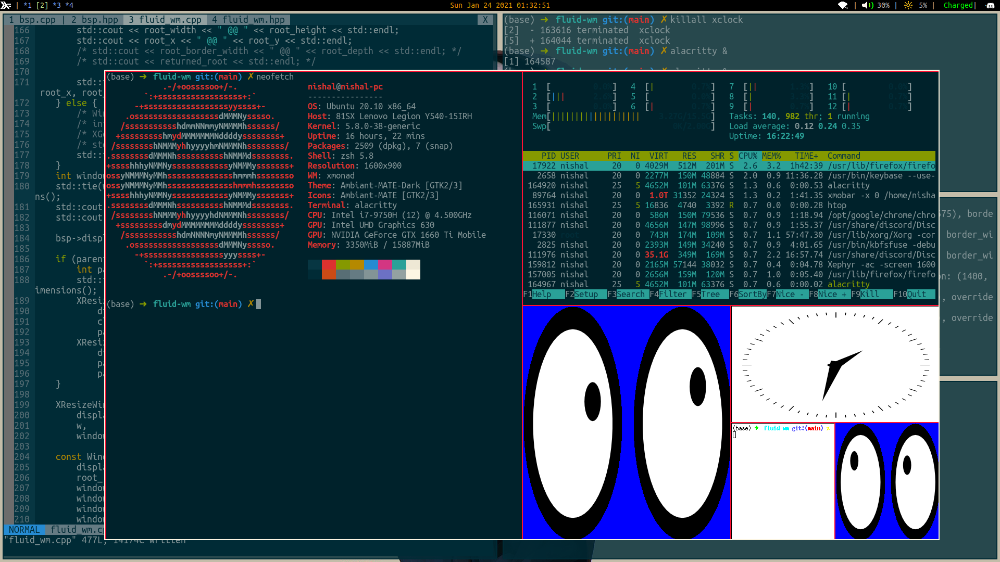

# fluid-wm


X11 tiling window manager written in C++



### Requirements
- libX11 (Xlib header files) 

### Build Instructions
```
meson setup builddir
ninja -C builddir
```
This creates an executable(fluid_wm) in builddir/src

### Testing
```
./tests/run_fluid_wm.sh
```